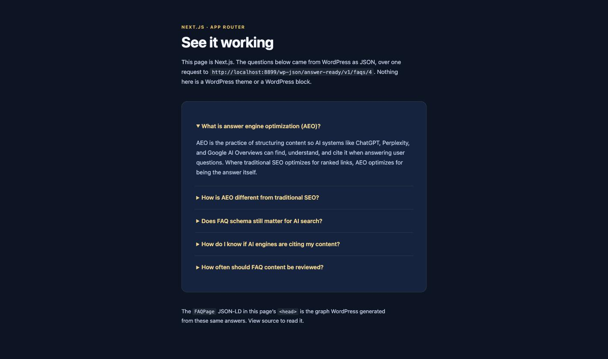

# Headless example — Next.js App Router

A WordPress FAQ, rendered by Next.js. WordPress stores the answers; this app asks for them over one HTTP request and draws the page itself.



It is about a hundred lines in total, and it ships **no client JavaScript** — the accordion uses native `<details>`, so every file here is a server component.

## Run it

```bash
cd examples/headless-nextjs
cp .env.example .env.local     # then point it at your WordPress site
npm install
npm run dev
```

```bash
# .env.local
WORDPRESS_URL=http://localhost:8888
WORDPRESS_FAQ_POST_ID=4
```

`WORDPRESS_URL` is any WordPress site running the [Answer-Ready FAQ Block](../../) plugin. `WORDPRESS_FAQ_POST_ID` is the post or page holding the FAQ block.

> The Playground demo will **not** work as `WORDPRESS_URL`. That site lives inside your browser behind a service worker and has no address anything outside the tab can reach. Use a local or hosted WordPress.

## What it does

`app/wordpress.js` is the only file that talks to WordPress:

```
GET ${WORDPRESS_URL}/wp-json/answer-ready/v1/faqs/${WORDPRESS_FAQ_POST_ID}
```

`app/layout.js` puts the `FAQPage` JSON-LD in `<head>`. `app/page.js` renders the questions. Both call the same `getFaqPage()`, and React memoises `fetch` for the length of a render, so that is still **one** request to WordPress.

## The point

The app never builds schema. It publishes the `schema` object WordPress sent, untouched:

```jsx
<script
    type="application/ld+json"
    dangerouslySetInnerHTML={ { __html: JSON.stringify( data.schema ) } }
/>
```

WordPress generated that graph from the same answers it sent in `faqs`, using the same builder its own front end renders with. So the headless page and the WordPress page publish identical structured data — with no schema logic living in this repo at all. Write it here instead and you have two sources that can drift, which is the problem the block was built to solve.

`answer` arrives already filtered through WordPress's inline-only `wp_kses()` allowlist, which is why it is safe to print directly.

## Not included

Deployment, ISR tuning, previews, and multi-post routing. This is the smallest thing that shows the endpoint working end to end.
